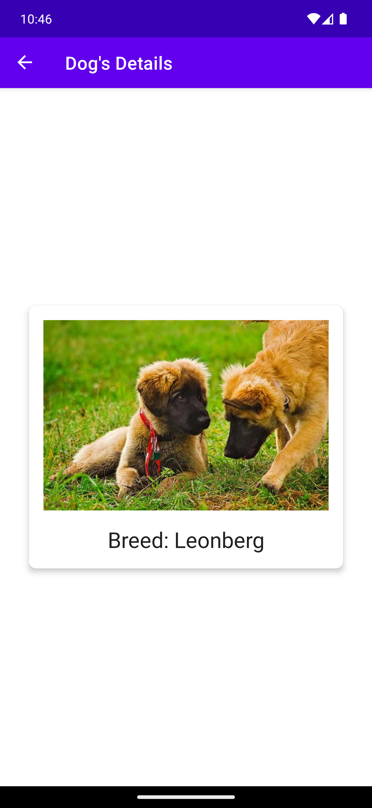
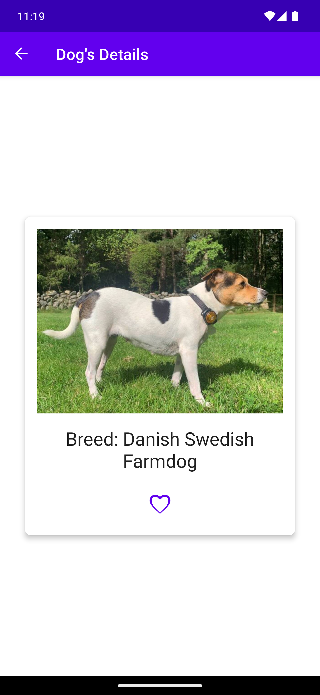
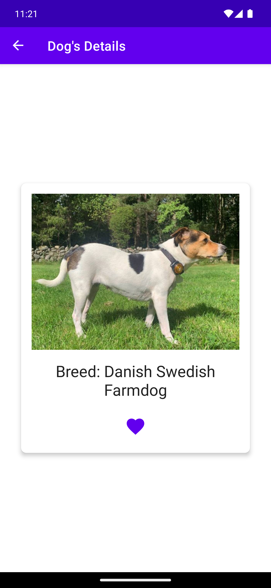
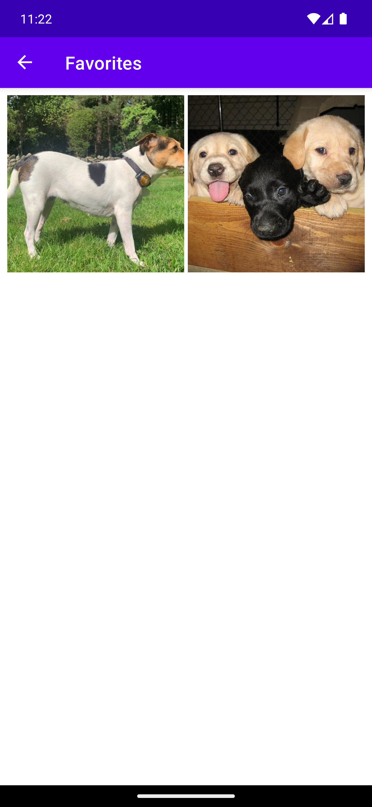

# DogsApp

[](https://github.com/Tarek-Bohdima/DogsApp/actions/workflows/build_pull_request.yml)
[](https://developer.android.com)
[](https://kotlinlang.org)
[](https://openjdk.org/projects/jdk/17/)
[](https://developer.android.com/build/releases/gradle-plugin)
[](app/build.gradle)
[](app/build.gradle)

A small Android sample app that fetches and displays random dog photos from the public [dog.ceo](https://dog.ceo/dog-api/) API. Built as a modern Android playground: KSP-only annotation processing, Coil 3, kotlinx.serialization, Room with Flow, and StateFlow-driven ViewModels.

## Screenshots

| Main grid | Dog details | Offline (cached) |
| --- | --- | --- |
|  |  |  |

The offline panel is captured with Wi-Fi and mobile data disabled and the app force-stopped: Room serves the cached list and Coil serves the previously-loaded images from its disk cache, while the status icon signals the failed refresh.

### Favorites flow

| Details (not favorited) | Details (favorited) | Favorites screen |
| --- | --- | --- |
|  |  |  |

## Features

- Grid of random dog images, refreshable via swipe-to-refresh
- Tap a dog to open a details screen
- Offline-first: cached list + image cache survive process death and no network
- Favorite individual dogs from the details screen and browse them on a Favorites screen
- Network layer with Retrofit + kotlinx.serialization
- Local persistence with Room exposing Flow
- Dependency injection with Hilt (KSP, no Kapt)
- StateFlow-driven `ViewModel`s collected via `repeatOnLifecycle`
- Navigation Component with Safe Args
- View Binding (no Data Binding XML expressions)

## Tech stack

| Area              | Library                                            |
| ----------------- | -------------------------------------------------- |
| Language          | Kotlin 2.3.21 on JDK 17                            |
| Build             | Android Gradle Plugin 9.2.0, Gradle 9.4.1          |
| Annotation proc.  | KSP 2.3.7 (no Kapt)                                |
| UI                | View system + View Binding, Material 1.13.0        |
| Architecture      | MVVM (ViewModel + StateFlow)                       |
| DI                | Hilt 2.59.2                                        |
| Persistence       | Room 2.8.4 (offline cache + favorites, Flow APIs)  |
| Networking        | Retrofit 2.11.0, kotlinx.serialization 1.11.0      |
| Async             | Kotlin Coroutines 1.11.0                           |
| Image loading     | Coil 3.4.0 (with `coil-network-okhttp`)            |
| Navigation        | AndroidX Navigation 2.9.8 (Safe Args)              |
| Lifecycle         | androidx.lifecycle 2.10.0                          |
| Refresh           | `SwipeRefreshLayout` 1.1.0                         |

## Project structure

```
app/src/main/java/com/example/android/dogsapp
├── common
│   ├── di/application      # Hilt module (Retrofit, Room, repository, image loader, refresh manager)
│   └── imaging             # ImageLoader interface + CoilImageLoader
├── data
│   ├── domain              # Dog (+ displayBreedName helper), DogsResponse
│   ├── network             # DogsApi (Retrofit interface)
│   ├── local               # Room: DogEntity, FavoriteEntity, DAOs, DogsDatabase, MIGRATION_1_2
│   └── repository          # DogsRepository (interface) + impl
└── ui
    ├── main                # MainFragment, MainViewModel, DogsAdapter
    ├── details             # DetailsFragment, DetailsViewModel
    ├── favorites           # FavoritesFragment, FavoritesViewModel
    └── utils               # RefreshManager / SwipeToRefreshManagerImpl
```

## Getting started

### Requirements

- Android Studio (Ladybug or newer recommended)
- JDK 17
- Android SDK with API level 36 installed

### Build & run

```bash
git clone https://github.com/Tarek-Bohdima/DogsApp.git
cd DogsApp
./gradlew assembleDebug
```

Then open the project in Android Studio and run the `app` configuration on an emulator or device (API 26+).

### Tests

```bash
./gradlew test
```

## Continuous Integration

Every pull request against `master` runs the [`Android CI`](.github/workflows/build_pull_request.yml) workflow on `ubuntu-latest`: it sets up JDK 17, caches Gradle, builds a debug APK, and runs unit tests.

## Documentation

- [ARCHITECTURE.md](ARCHITECTURE.md) — how the layers fit together, why we picked each piece of the stack.
- [CONTRIBUTING.md](CONTRIBUTING.md) — branch/PR/squash workflow, conventions, how to add a feature, PR checklist.
- [CLAUDE.md](CLAUDE.md) — onboarding for Claude Code agents working in this repo.

## Credits

Dog images provided by the free [Dog CEO API](https://dog.ceo/dog-api/).
